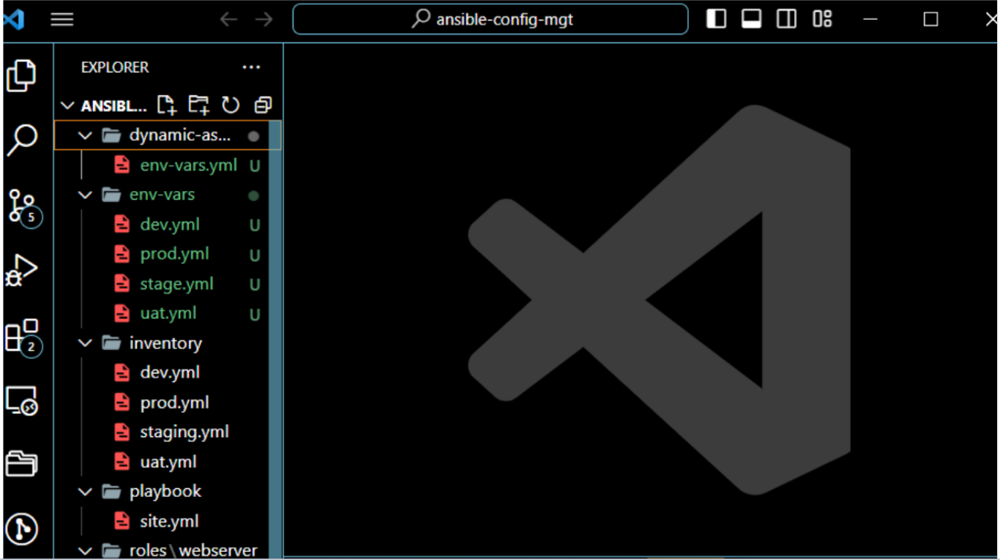
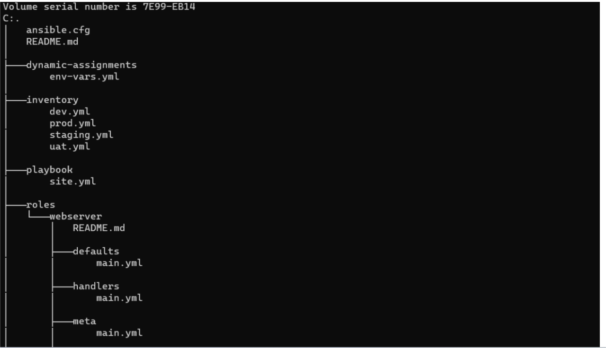
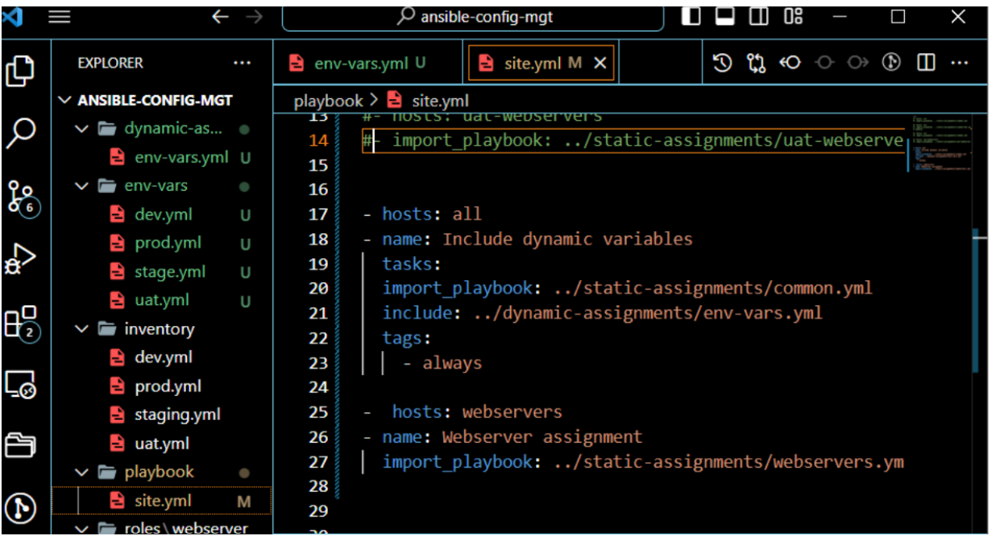
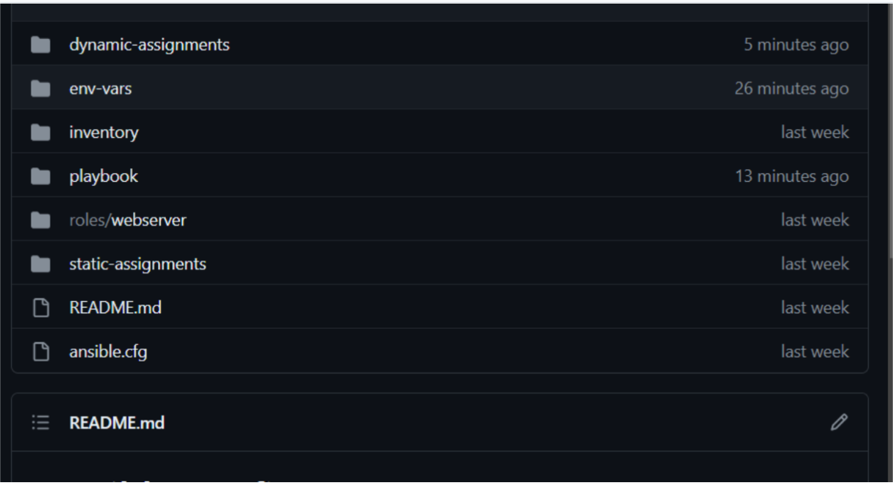
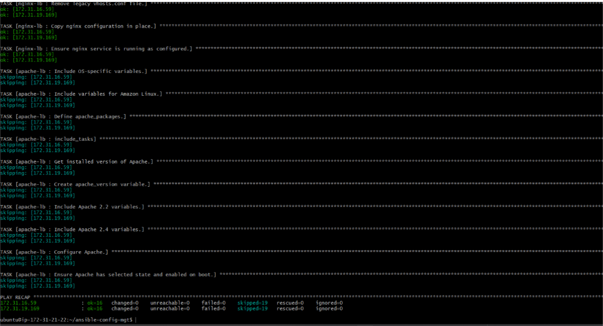
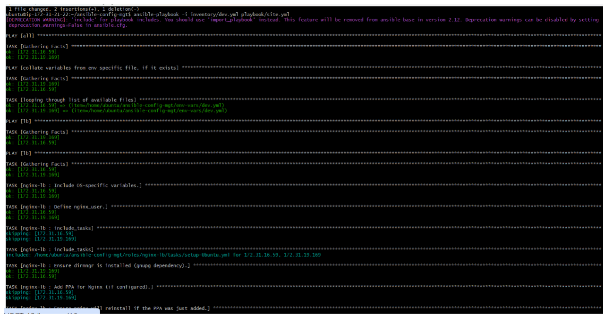
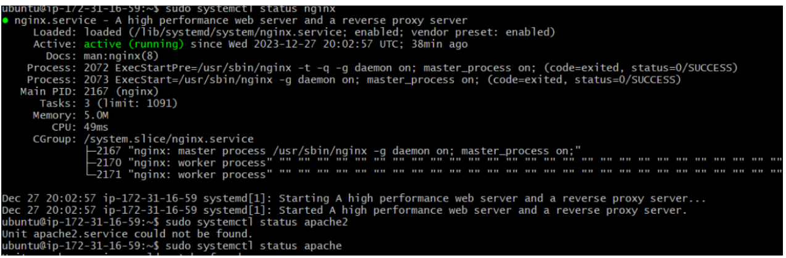

## ANSIBLE DYNAMIC ASSIGNMENTS (INCLUDE) AND COMMUNITY ROLES
I created a dynamic assignment branch and new folder called dynamic assignment and a file called env-vars.yml

Setting nginx and apache loadbalancers
On defaults/main new configuration setting made and on static assignments folrders created file for apache and nginx and then ran the play book to install and configure nginx as a load balancer and repeat the same for apache

To confirm its running

