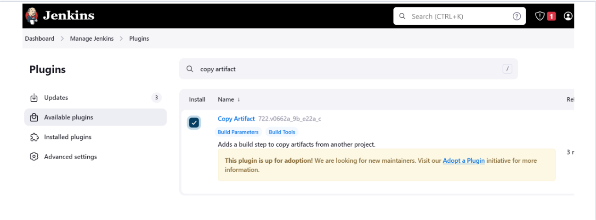
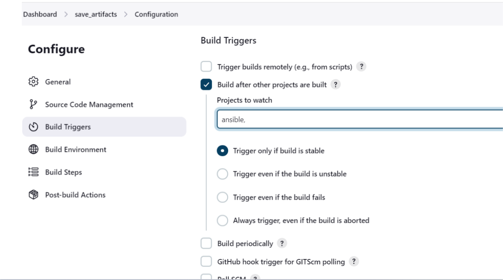
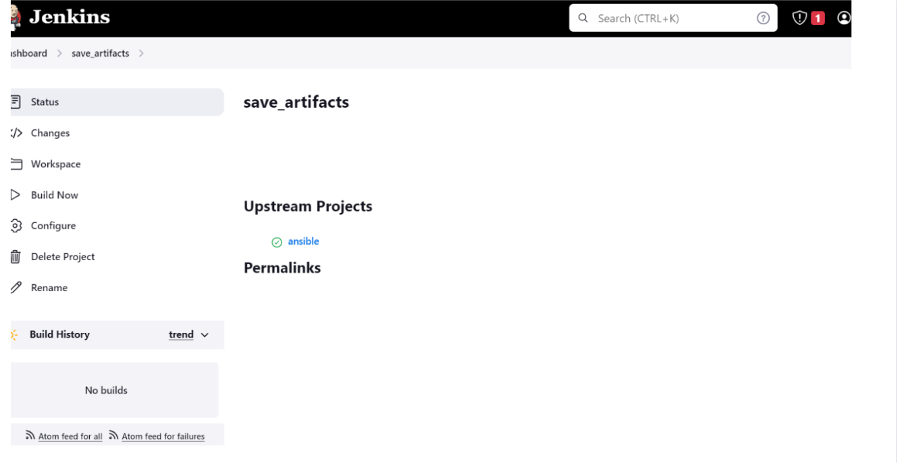

## ANSIBLE REFRACTORING ASSIGNMENT AND IMPORTS

AIM The purpose of this project is to improve on the code arragement, readibility and scalabilit of project 11 and creating a path to save all artifact in other to decloud our jenkins server from getting conjested.

Step 1: Setting up the server
log into the jenkins web console to install a plugin called "copy artifacts" without restarting jenkins on this path, manage jenkins>>plugins>>tab search for "copy artifact"

Configuring UAT wedservers with a role webserver

To confirm if the tooling interface shows, the public ip of my server was tried on the web/index.php

