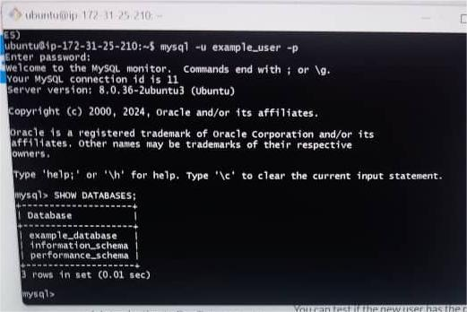

## UNDERSTANDING CLIENT-SERVER ARCHITECTURE

Client Server Architecture with MySQL

Client-server refers to an architecture in which two or more computers are connected over a network to send and receive request s between one and another.

In their communication, each machine has its own role : The machine sending the request is referred to as the CLIENT and the machine responding (serving) is referred to as the SERVER.

IMPLEMENTING CLIENT-SERVER ARCHITECTURE USING MYSQL DATABASE MANAGEMENT SYSTEM
To demonstrate basic client-server using MySQL RDBMS
Create and configure two linux based virtual servers (EC2 instances on AWS)
Server 1: MySQL-Server (To serve information)

Server 2: MySQL-Client (To request information)

