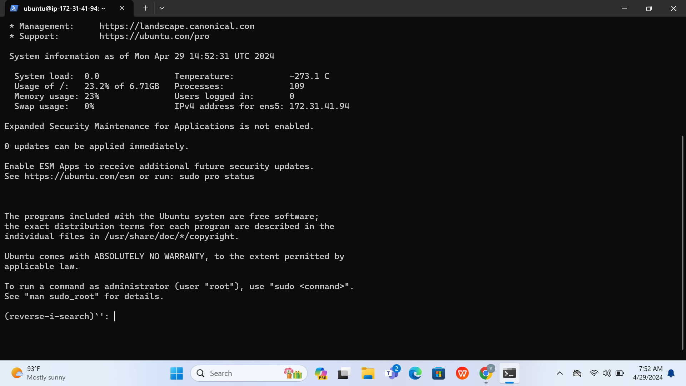
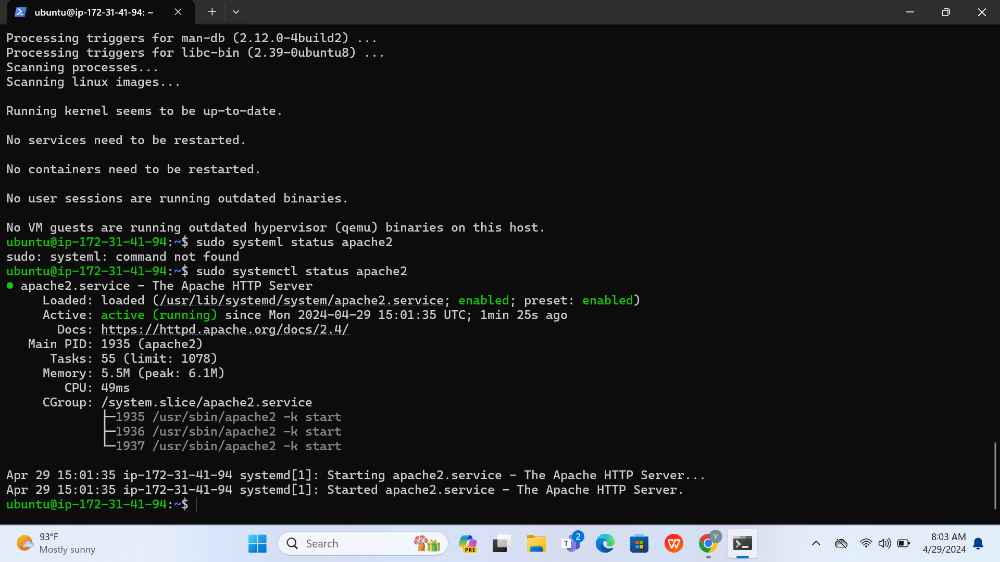
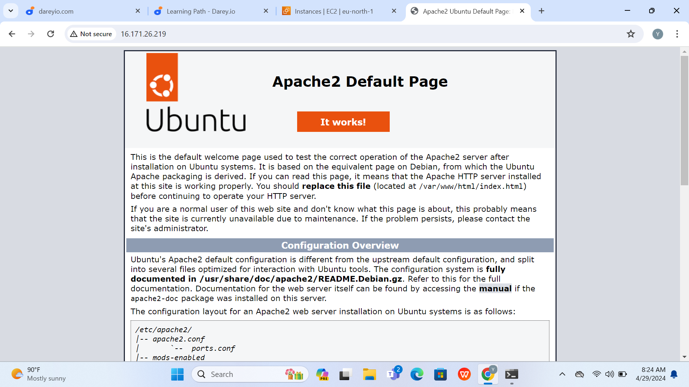
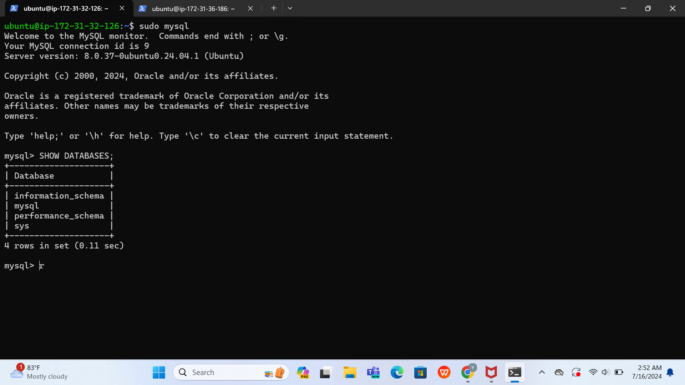
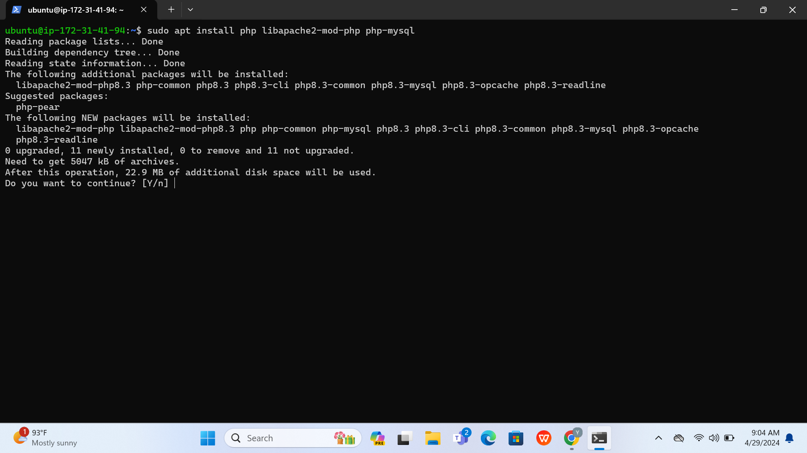
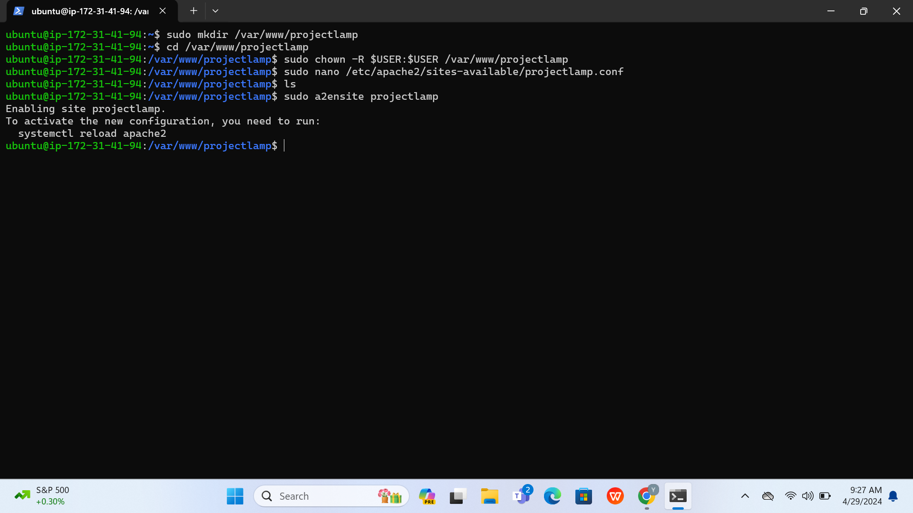
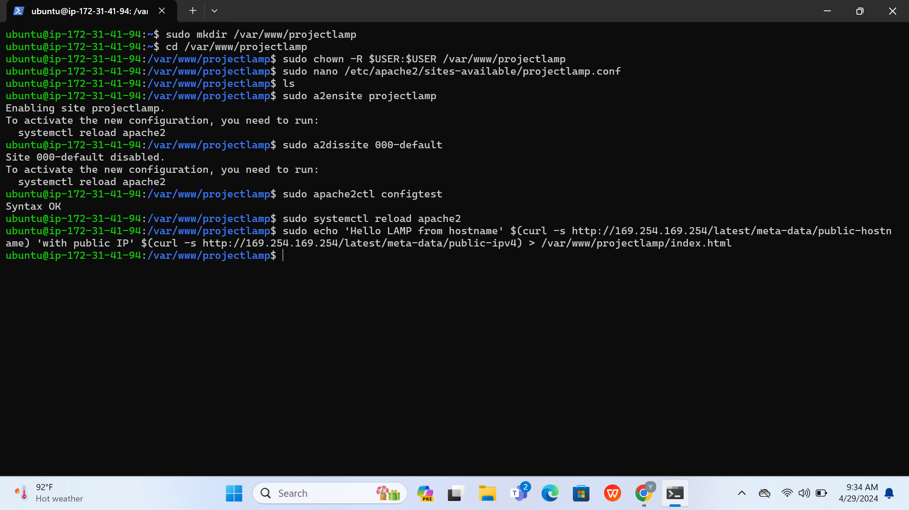

## LAMPSTACK IMPLEMENTATION PROJECT
connected to ec2 instance using Terminal 

Installing Apache and Updating the Firewall

To verify apache2 is running as a service in the OS

sudo systemctl status apache2

To test how Apache server responds to HTTP request from the internet

