## WEB STACK PROJECT IMPLEMENTATION (LEMP STACK)

SSH into my Nginx Web Server
ssh -i <Your-private-key.pem> ubuntu@<EC2-Public-IP-address>

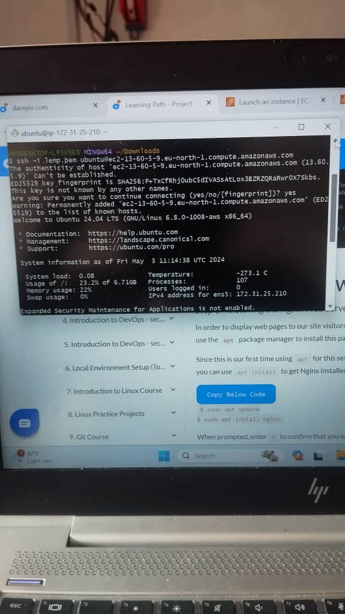

Installing the Nginx Web Server

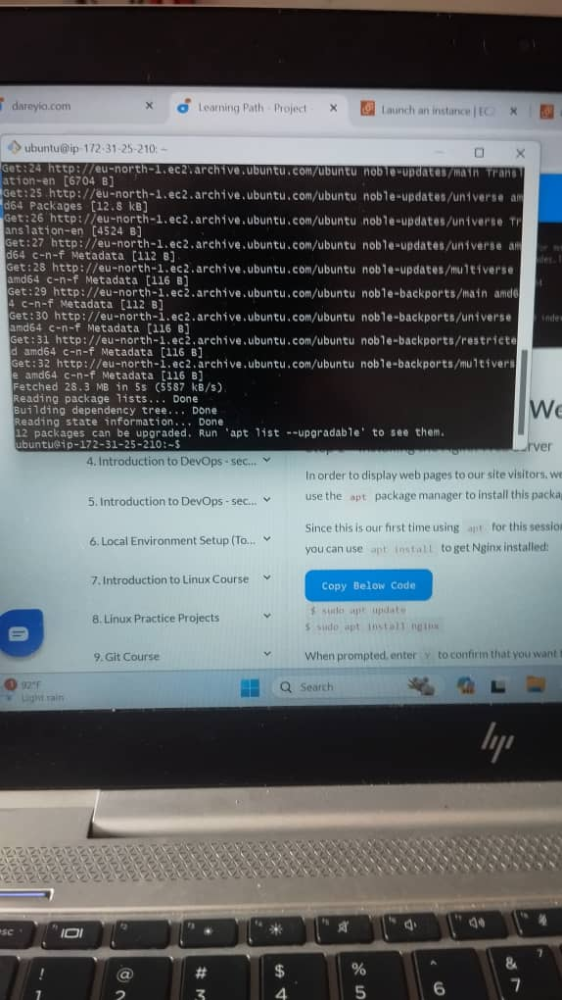

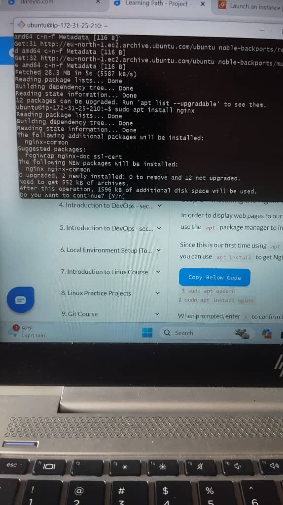

To verify that nginx was installed properly

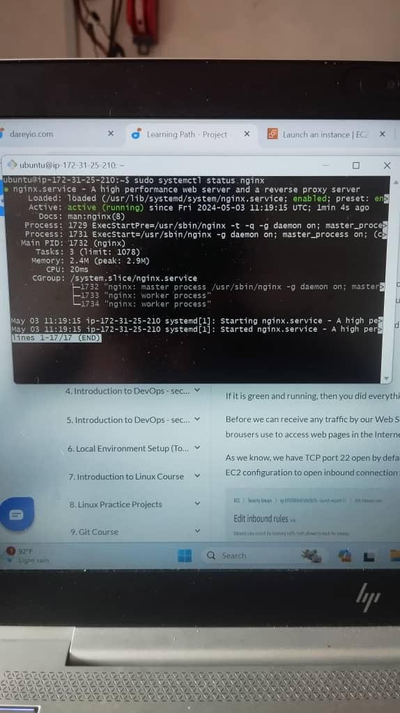

To access Nginx server via local machine
Run curl http://localhost:80

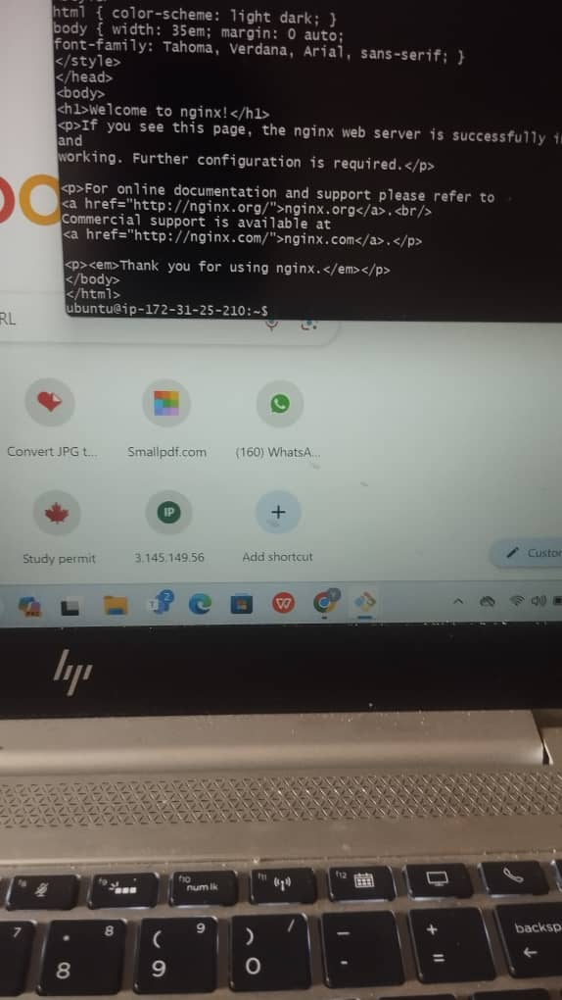

To Access Nginx via the web browser using the public IP Address.

http://<Public-IP-Address>:80

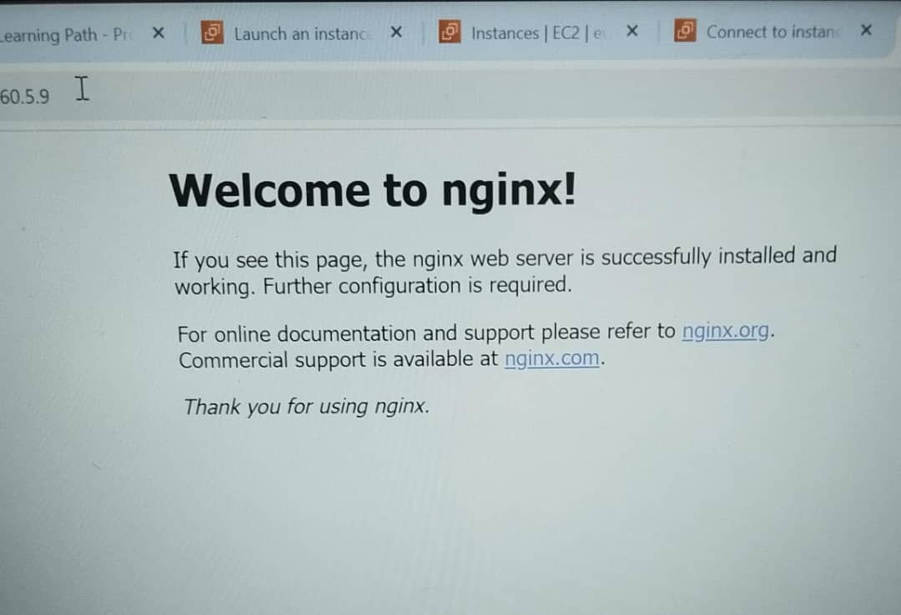

INSTALLING MYSQL
MySQL is an open-source relational database management system and is the third layer of the LAMP stack. The LAMP model uses MySQL for storing, managing, and querying information in relational databases. For example, developers store application data, such as customer records, sales, and inventories. When a user searches for information, the web server queries the stored data in MySQL. Query refers to special instructions for manipulating data in a relational database with the SQL language.

To Install mysql on Nginx Server

sudo apt install mysql-server

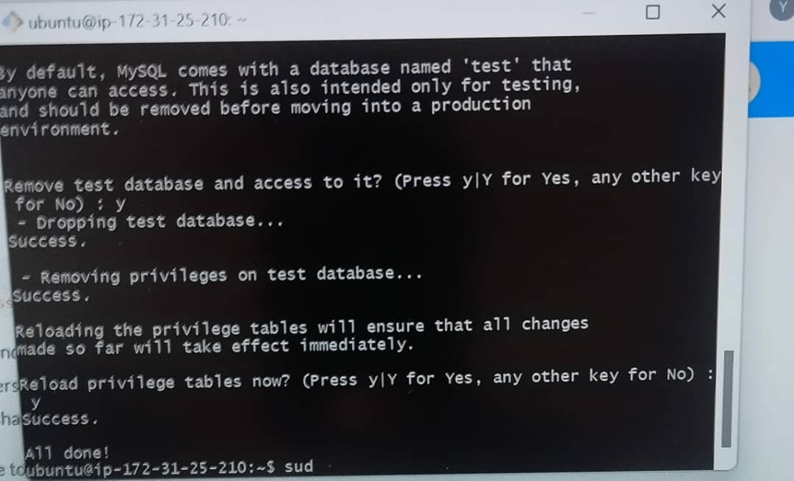

To Login into mysql console

sudo mysql -p

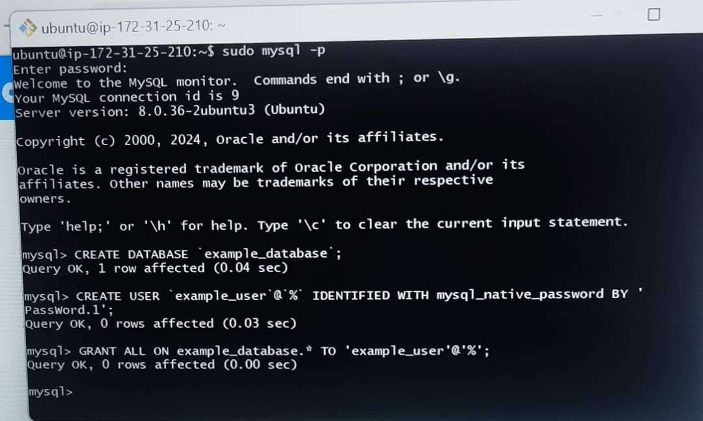

Start the interactive script my running the below command

sudo mysql_secure_installation

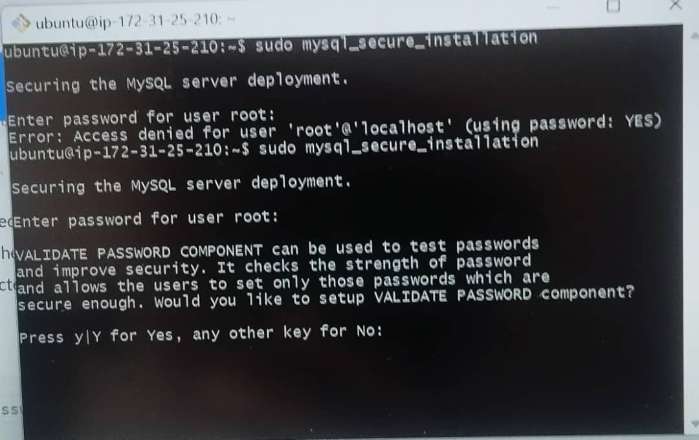

INSTALLING PHP
Nginx is installed to serve your content while MySQL is installed to store and manage our data. Hence, PHP is used to process code and generate dynamic content for the web server.

While Apache embeds the PHP interpreter in each request, Nginx requires an external program to handle PHP processing and act as a bridge between the PHP interpreter itself and the web server. This allows for a better overall performance in most PHP based website, but it requires additional configuration. Therefore, we will need to install php-fpm which stands for "PHP fastCGI process manager", and tell Nginx to pass PHP requests to this software for processing.

Also, php-mysql, a PHP module that allows PHP to communicate with MySQL-based databases.

To Install the 2 packages.

sudo apt install php-fpm php-mysql

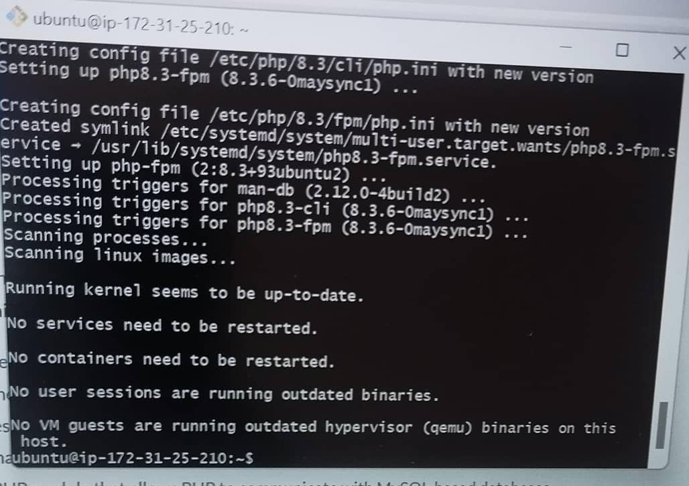

Configuring Nginx to Use PHP Processor
When using the Nginx web server, we can create server blocks (similar to virtual hosts in Apache) to encapsulate configuration details and host more than one domain on a single server. In this guide, we will use projectLEMP as an example domain name.

On Ubuntu, Nginx has one server block enabled by default and is configured to serve documents out of a directory at /var/www/html. While this works well for a single site, it can become difficult to manage if you're hosting multiple sites. Instead of modifying /var/www/html, we'll create a directory structure within /var/www for the your_domain website, leaving /var/www/html in place as default directory to be served if a client request does not match any other sites.

Create a root web directory for your_domain as follows

sudo mkdir /var/www/projectLEMP

Assign ownership of the directory to the $USER environment variable, which will reference the current system user

sudo chown -R $USER:$USER /var/www/projectLEMP

Then, create and open a new configuration file in Nginx site-available directory using the nano command.

sudo nano /etc/nginx/sites-available/projectLEMP

Once the Nano editor opens, paste the below command and proceed to save

#/etc/nginx/sites-available/projectLEMP

server {
    listen 80;
    server_name projectLEMP www.projectLEMP;
    root /var/www/projectLEMP;

    index index.html index.htm index.php;

    location / {
        try_files $uri $uri/ =404;
    }

    location ~ \.php$ {
        include snippets/fastcgi-php.conf;
        fastcgi_pass unix:/var/run/php/php8.1-fpm.sock;
     }

    location ~ /\.ht {
        deny all;
    }

}

server {
    listen 80;
    server_name projectLEMP www.projectLEMP;
    root /var/www/projectLEMP;

    index index.html index.htm index.php;

    location / {
        try_files $uri $uri/ =404;
    }

    location ~ \.php$ {
        include snippets/fastcgi-php.conf;
        fastcgi_pass unix:/var/run/php/php8.1-fpm.sock;
     }

    location ~ /\.ht {
        deny all;
    }

}

server {
    listen 80;
    server_name projectLEMP www.projectLEMP;
    root /var/www/projectLEMP;

    index index.html index.htm index.php;

    location / {
        try_files $uri $uri/ =404;
    }

    location ~ \.php$ {
        include snippets/fastcgi-php.conf;
        fastcgi_pass unix:/var/run/php/php8.1-fpm.sock;
     }

    location ~ /\.ht {
        deny all;
    Activate the configuration by linking to the config file from Nginx site-enabled directory.

sudo ln -s /etc/nginx/sites-available/projectLEMP /etc/nginx/sites-enabled/

The below command will tell Nginx to use the configuration next time it is reloaded. To test the config syntax error by typing the below command.

sudo nginx -t

We need to now disable the default Nginx host that is currently configured to listen on port 80, please run the command below for this to be done.

sudo unlink /etc/nginx/sites-enabled/default
After creating the index.html file, copy the below command and paste in your script shell local host

sudo echo 'Hello LEMP from hostname' $(curl -s http://169.254.169.254/latest/meta-data/public-hostname) 'with public IP' $(curl -s http://169.254.169.254/latest/meta-data/public-ipv4) > /var/www/projectLEMP/index.html

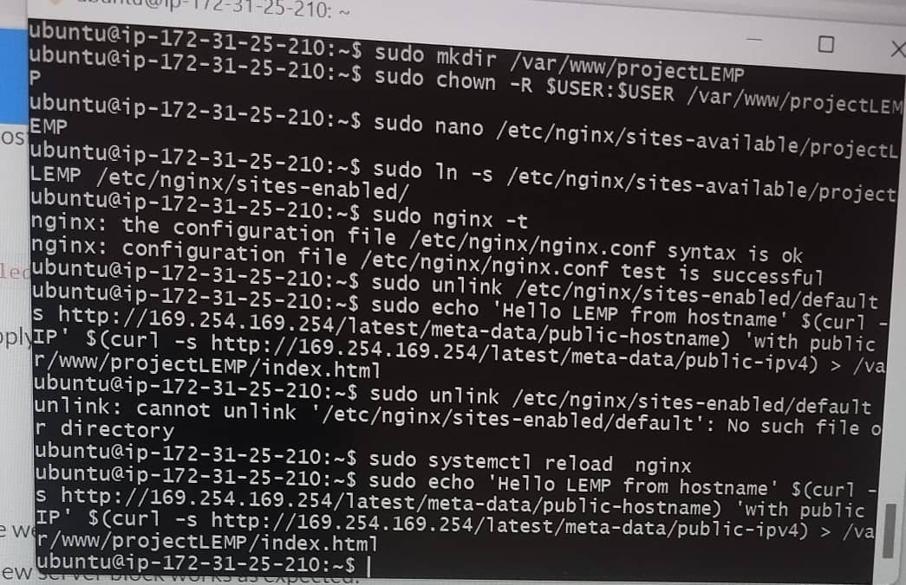

To try to open my website through my web browser, using the my public IP, run the below command.

http://<Public-IP-Address>:80

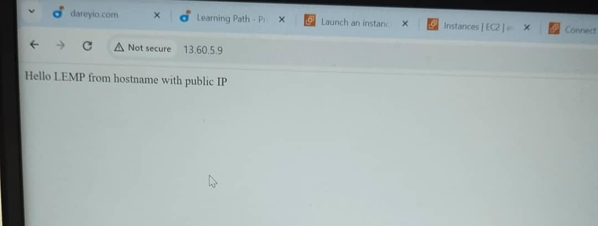

