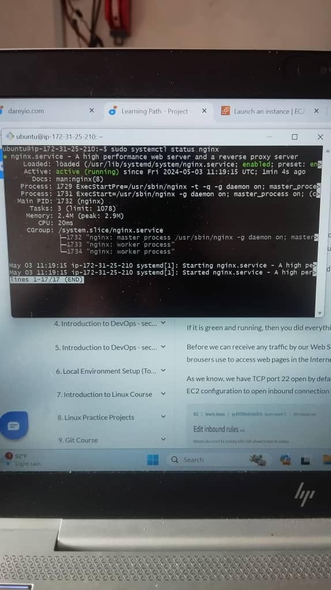
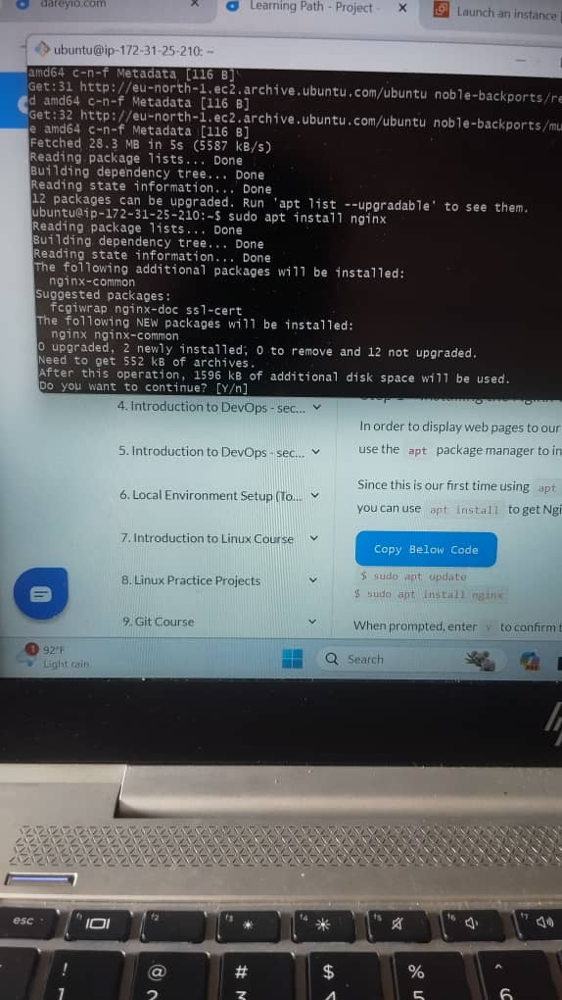
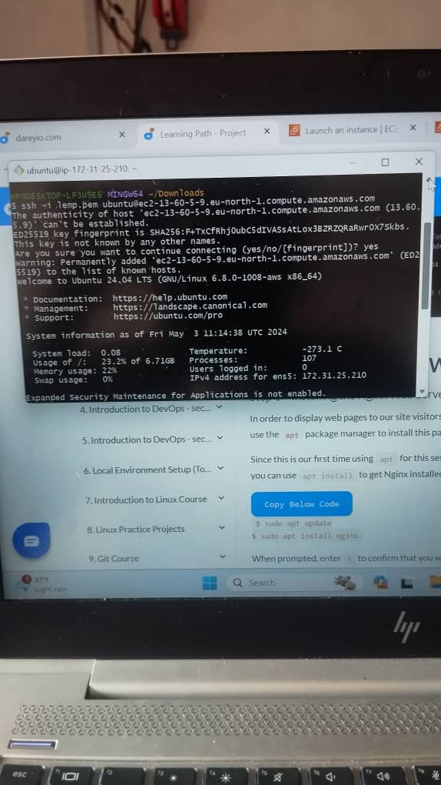

## WEB STACK PROJECT IMPLEMENTATION (LEMP STACK)

SSH into my Nginx Web Server
ssh -i <Your-private-key.pem> ubuntu@<EC2-Public-IP-address>

Installing the Nginx Web Server

To verify that nginx was installed properly

To access Nginx server via local machine
Run curl http://localhost:80

or curl http://127.0.0.1:80

To Access Nginx via the web browser using the public IP Address.

http://<Public-IP-Address>:80

