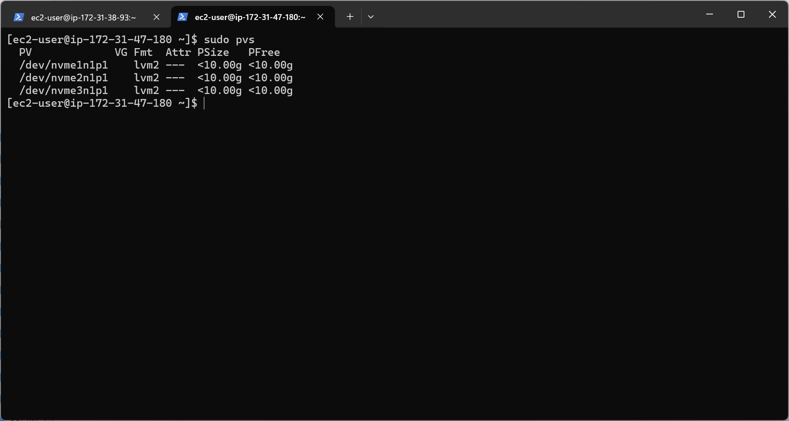

## IMPLEMENTING WORDPRESS WEBSITE WITH LOGIC VOLUME MANAGEMENT (LVM) STORAGE MANAGEMENT 

To inspect what block device is attched to the server
lsblk

To see all mount and free space on the web-server
df -h
To create a single partition on each of the disk using the gdisk Utility, run the below command:
sudo gdisk /dev/nvme1n1
sudo gdisk /dev/nvme2n1
sudo gdisk /dev/nvme3n1

To create a single partition on each of the disk using the gdisk Utility, run the below command:
sudo gdisk /dev/nvme1n1
sudo gdisk /dev/nvme2n1
sudo gdisk /dev/nvme3n1

To view the newly configured partition on each of the 3 disks
lsblk 

Install lvm2 package using the below command;
sudo yum install lvm2

 

Run the below command to check for available partitions

sudo lvmdiskscan

To format the logical app and log Volumes with ext4 file system using mkfs.ext4
sudo mkfs -t ext4 /dev/webdata-vg/apps-lv
sudo mkfs -t ext4 /dev/webdata-vg/logs-lv

To back up files in the log directory /var/log into home/recovery/logs using the rsync utility script, please run the below;
sudo rsync -av /var/log/. /home/recovery/logs/

To update /etc/fstab so that the mount configuration will persist after restart. Copy the UUID of the device to upate the /etc/fstab
sudo blkid

To test the configuration and reload the Daemon
sudo mount -a 
AND

sudo systemctl daemon-reload

HEADING - INSTALLING WORDPRESS AND CONFIGURING IT TO USE MYSQL DATABASE

Connect to the DB-Server via ssh. Then, to see the newly created devices

lsblk

To create a single partition on each of the 3 disks

sudo gdisk /dev/nvme1n1
sudo gdisk /dev/nvme2n1
sudo gdisk /dev/nvme3n1

