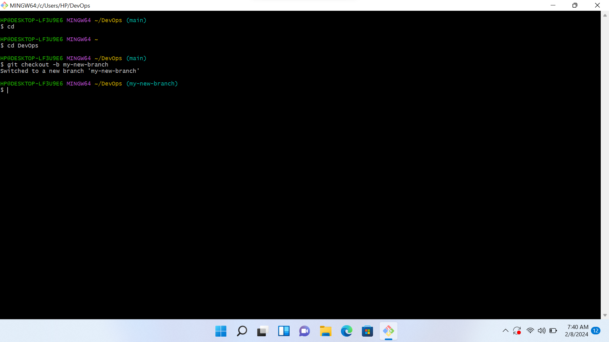

# These are the screenshots of my github projects done on gitbash to get familiarized with git !
## These are the images !

**The cd command is to change a working directory**

**The git checkout command is for checking out of a branch**

**The echo command displays the output without trailing the new line**

**The cd DevOps command is used to change into the working directory "DevOps"**

