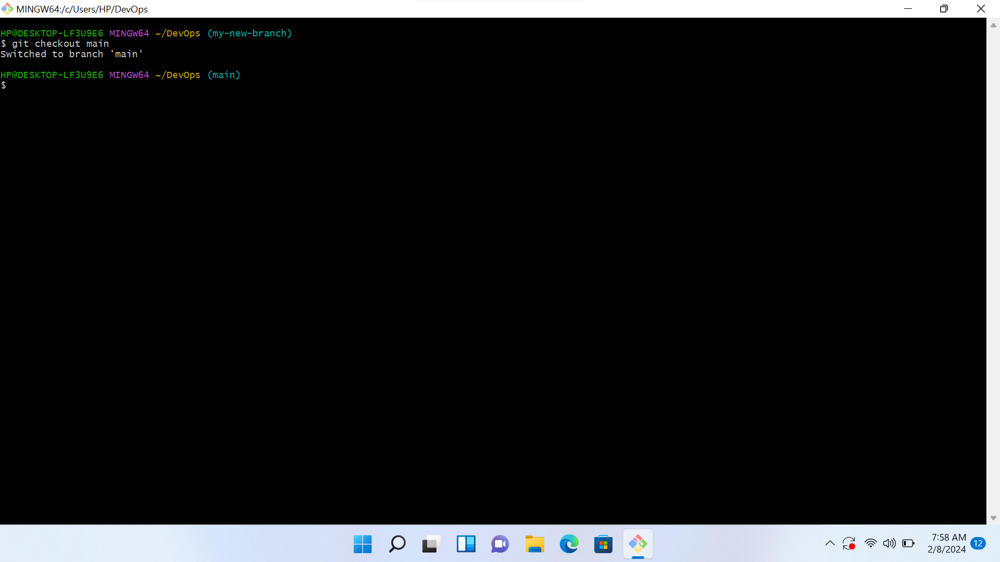

## These are the screenshots of my github projects done on gitbash to get familiarized with git !
## These are the images !

**The cd command is to change a working directory**

**The git checkout command is for checking out of a branch**

**The echo command is used to display a line of text on the terminal**

